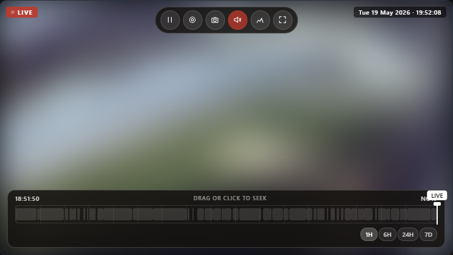
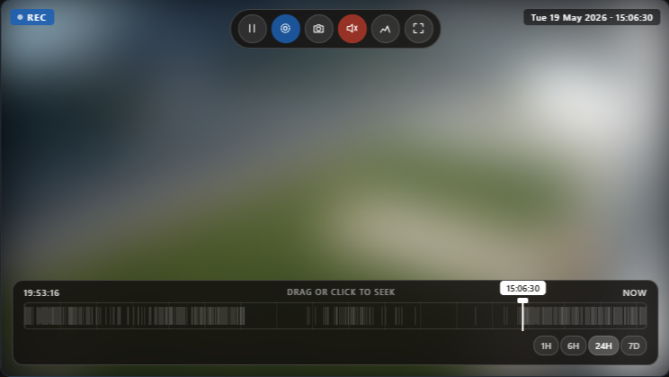
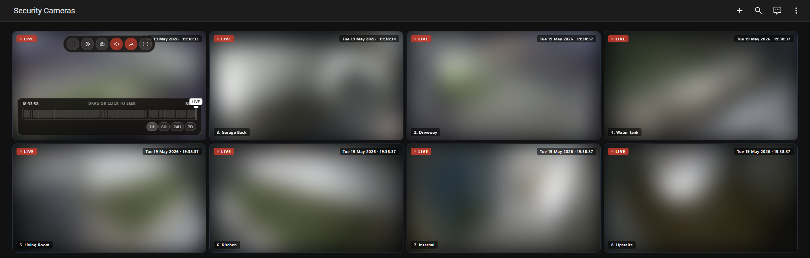

# NX Witness for Home Assistant

[](https://github.com/hacs/integration)
[](https://www.home-assistant.io/)
[](https://developers.home-assistant.io/docs/integration_quality_scale_index/)

A read-only Home Assistant integration for [NX Witness](https://www.networkoptix.com/nx-witness) and compatible VMS systems like Nx Meta. It adds your cameras as Home Assistant entities, motion binary sensors, a recorded clip browser, and an optional Lovelace card with a timeline you can drag.

Read-only means the integration only ever reads from the server. It never changes cameras, recordings, or server settings. The one exception is session-token auth, which has to create a login session on the server to get a token. Basic auth avoids even that.

[](https://my.home-assistant.io/redirect/hacs_repository/?owner=lolstring&repository=ha-nxwitness&category=integration)



## Features

- A camera entity for each NX Witness camera
- A motion binary sensor per camera, with a look-back window you can set
- A recorded clip browser in the Home Assistant media browser
- An optional Lovelace card with live view, a draggable timeline, and archive seek
- Video wall support: one card can render a whole NX Witness video wall
- Read-only: the integration does not modify anything on the NX Witness server

## Requirements

- Home Assistant 2026.3 or newer
- An NX Witness server that Home Assistant can reach
- An NX Witness account (a read-only account is recommended)

## Installation

### HACS (recommended)

1. Click the button above, or open HACS and go to **Integrations**.
2. Open the menu in the top right and select **Custom repositories**.
3. Add `https://github.com/lolstring/ha-nxwitness` as an **Integration**.
4. Search for **NX Witness** and install it.
5. Restart Home Assistant.
6. Go to **Settings > Devices & Services > Add Integration** and search for **NX Witness**.

### Manual

1. Copy `custom_components/nxwitness` into your Home Assistant `/config/custom_components/` folder.
2. Restart Home Assistant.
3. Go to **Settings > Devices & Services > Add Integration** and search for **NX Witness**.

## Configuration

Everything is set up through the UI. When you add the integration you are asked for:

| Field | Description |
| --- | --- |
| Host | IP or hostname of your NX Witness server |
| Port | Default is `7001` |
| Use HTTPS | Turn on for secure connections |
| Verify SSL | Turn this off for self-signed certificates |
| Authentication mode | `Basic` (read-only, preferred) or `Session token` |
| Username / Password | Your NX Witness credentials |
| Recent motion window | How many seconds back to check for recent motion |

> **NX 5 / NX 6 note:** newer NX Witness servers turn off Basic auth by default and require HTTPS. On a stock NX 6 server, use **Session token** auth and turn on **Use HTTPS**. Basic auth only works if you have turned it back on in the server settings.

After setup, click **Configure** on the integration card to change:

| Option | Description |
| --- | --- |
| Enable camera entities | Create a camera entity per camera |
| Enable motion sensors | Create a motion binary sensor per camera |
| Enable clip browser | Show recorded clips in the media browser |
| Enabled cameras | Pick which cameras to expose |
| Motion window | Seconds to look back when checking for motion (5 to 3600) |
| Motion detection source | `Motion` for server-side detection, `Recording` for in-camera or analytics detection, or `Analytics` |
| Scan interval | How often to refresh camera and layout data, in seconds (5 to 300) |
| Default stream | Primary, Secondary, or Auto (the Auto value is stored as `undefined`, not `auto`) |
| Live stream format | MP4, WebM, MPEG-TS, or MJPEG (the MPEG-TS value is `mpegts`) |
| Live stream resolution | For example `1080p` or `720p` |
| Clip format | Format used for media browser clips |
| Clip FPS | Frame rate for media browser clips (1 to 60) |
| Clip look-back days | How many days of clips to list in the media browser (1 to 90) |

## Lovelace card







The repository includes an optional Lovelace card at `www/nxwitness-camera-card/nxwitness-camera-card.js`. It gives you a full-width view with hover controls, a draggable timeline, archive seek, and video wall support.

### Install the card

1. Copy `www/nxwitness-camera-card/nxwitness-camera-card.js` to `/config/www/nxwitness-camera-card/` on your Home Assistant instance.
2. Go to **Settings > Dashboards > Resources** and add:
   - URL: `/local/nxwitness-camera-card/nxwitness-camera-card.js`
   - Type: **JavaScript module**
3. Reload your browser.

### Basic single-camera card

```yaml
type: custom:nxwitness-camera-card
entity_id: camera.front_door
```

The card reads the camera entity's attributes to find the camera ID and config entry, so that is all you need.

### Single-camera card with all options

```yaml
type: custom:nxwitness-camera-card
entity_id: camera.front_door
title: Front Door
stream: primary       # primary or secondary
format: mp4           # mp4 or webm
resolution: 1080p
duration_ms: 300000   # archive clip length in ms (5 minutes by default)
show_name: true
show_timestamp: true
show_play: true
show_live: true
show_snapshot: true
show_mute: true
show_quality: true
show_fullscreen: true
```

The card plays into a normal HTML video element, so use `mp4` or `webm`. The `mpegts` and `mjpeg` formats are for the integration's stream options, not this card.

### Video wall card

```yaml
type: custom:nxwitness-camera-card
mode: video-wall
config_entry_id: YOUR_CONFIG_ENTRY_ID
video_wall_id: YOUR_VIDEO_WALL_ID
title: All Cameras
```

In video wall mode there is no camera entity to read, so you must pass `config_entry_id` as well as `video_wall_id`. The easiest way to get both is the visual card editor, which has dropdowns for the integration and the video wall. To set them by hand, get `video_wall_id` from the `nxwitness.get_video_walls` service (see [Services](#services) below), and get `config_entry_id` from **Settings > Devices & Services**, by opening the NX Witness entry and copying the ID from the URL.

## Automations

### Send a notification when motion is detected

List every motion sensor in one trigger. `trigger.to_state` always points at the sensor that fired, so a single automation covers all cameras. The `snapshot_url` attribute is a signed URL to a still from the NX Witness server, taken at the moment the motion started. It is not a live frame grabbed when the notification is sent.

```yaml
alias: NX Witness motion alert
trigger:
  - platform: state
    entity_id:
      - binary_sensor.front_door_motion
      - binary_sensor.garage_motion
      - binary_sensor.driveway_motion
    to: "on"
action:
  - action: notify.mobile_app_your_phone
    data:
      title: Motion detected
      message: "Motion on {{ trigger.to_state.name }}"
      data:
        image: "{{ trigger.to_state.attributes.snapshot_url }}"
        tag: "{{ trigger.to_state.entity_id }}"
        when: >
          {{ (trigger.to_state.attributes.last_motion_start_ms | int / 1000) | int }}
```

> **iOS live preview:** add `entity_id: camera.front_door` (matching the camera that fired) inside `data:` to show a live camera feed in the notification.

### Notification with a link to recorded clips

The `clips_media_source` attribute holds the media browser path for that camera's recent clips. It is only present when the clip browser is enabled.

```yaml
alias: NX Witness motion with clip link
trigger:
  - platform: state
    entity_id:
      - binary_sensor.front_door_motion
      - binary_sensor.garage_motion
    to: "on"
action:
  - action: notify.mobile_app_your_phone
    data:
      title: "Motion on {{ trigger.to_state.name }}"
      message: Tap to review the recording.
      data:
        image: "{{ trigger.to_state.attributes.snapshot_url }}"
        url: >
          /media-browser/{{ trigger.to_state.attributes.clips_media_source }}
```

### Turn on a light when motion is detected, then turn it off

```yaml
alias: NX Witness motion light
trigger:
  - platform: state
    entity_id: binary_sensor.driveway_motion
    to: "on"
action:
  - action: light.turn_on
    target:
      entity_id: light.driveway
  - wait_for_trigger:
      - platform: state
        entity_id: binary_sensor.driveway_motion
        to: "off"
  - action: light.turn_off
    target:
      entity_id: light.driveway
```

### Log motion events to a Google Sheet (or any webhook)

```yaml
alias: NX Witness motion log
trigger:
  - platform: state
    entity_id:
      - binary_sensor.front_door_motion
      - binary_sensor.garage_motion
    to: "on"
action:
  - action: rest_command.log_motion
    data:
      camera: "{{ trigger.to_state.name }}"
      timestamp: "{{ now().isoformat() }}"
```

## Services

All services are read-only and return a response. They do not change anything on the NX Witness server. If you have more than one NX Witness entry configured, pass `config_entry_id` to pick a specific server.

| Service | Description |
| --- | --- |
| `nxwitness.get_stored_files` | List stored files on the server |
| `nxwitness.get_layouts` | Return layout metadata |
| `nxwitness.get_video_walls` | Return video wall metadata |
| `nxwitness.get_video_wall_render_plan` | Expand a video wall into its tiles (used by the card) |

### Get layouts

```yaml
action: nxwitness.get_layouts
data:
  include_layout_items: true
response_variable: nx_layouts
```

### Get video walls

```yaml
action: nxwitness.get_video_walls
response_variable: nx_walls
```

The response includes an `id` field for each video wall. Use that as `video_wall_id` in your card config.

### Get video wall render plan

```yaml
action: nxwitness.get_video_wall_render_plan
data:
  video_wall_id: "your-video-wall-uuid"
response_variable: nx_plan
```

### Get stored files

```yaml
action: nxwitness.get_stored_files
data:
  path: ""
response_variable: nx_files
```

## Removing the integration

1. Go to **Settings > Devices & Services**.
2. Find the **NX Witness** entry.
3. Open the menu and choose **Delete**.

If you installed through HACS, you can also remove it from HACS and restart. For a manual install, delete `custom_components/nxwitness` from your `/config` directory and restart.

The integration does not store any data outside the config entry, so deleting the entry removes everything.

## Development

Open the repo in the dev container (`.devcontainer/devcontainer.json`), then use the one-command scripts:

| Command | What it does |
| --- | --- |
| `scripts/setup` | Install dev dependencies |
| `scripts/develop` | Run Home Assistant from source with this integration loaded, debug logging, and a debugpy listener on `:5678`. It generates a `./config` folder, which is git-ignored. |
| `scripts/lint` | `black` then `ruff --fix` |
| `scripts/test` | Run the unit suite with coverage (extra args are passed through) |

**Fast loop:** run `scripts/develop`, open <http://localhost:8123>, and add the **NX Witness** integration. Edit code, press `Ctrl-C`, and re-run. Or attach the VS Code **"Home Assistant (develop)"** debug config for breakpoints. Test coverage must stay at or above 95%, which `scripts/test` enforces.

**Prod-like loop (docker image):** the dev container also defines a `homeassistant` service that uses the official Home Assistant image with the component bind-mounted read-only. Copy the sample config first:

```
cp -r local-testing/config.sample local-testing/config            # bash
Copy-Item -Recurse local-testing/config.sample local-testing/config   # PowerShell
docker compose up -d homeassistant
```

Because the mount is read-only, apply Python changes with the **"Restart Home Assistant"** task (or `docker compose restart homeassistant`). To debug, attach the **"Python: Attach to Home Assistant (docker)"** config. The sample config turns on `debugpy`.

### End-to-end testing (real NX Witness server)

A gated end-to-end stack runs the integration against a real containerised NX Witness (Meta VMS) server, with the bundled Testcamera running inside it. It does not run in the default `pytest` suite (the `e2e` marker is filtered out in `pyproject.toml`) and is started on its own:

```
pwsh scripts/e2e.ps1     # Windows
bash scripts/e2e.sh      # Linux and macOS
```

See [local-testing/e2e/README.md](local-testing/e2e/README.md) for the one-time setup. The prebuilt image is pulled for you. You only supply a sample clip and, optionally, a trial license that enables the motion and clip tests.
